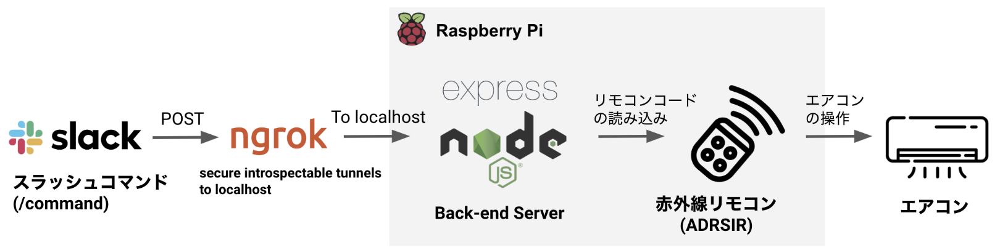
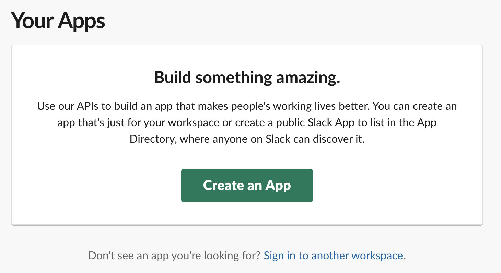
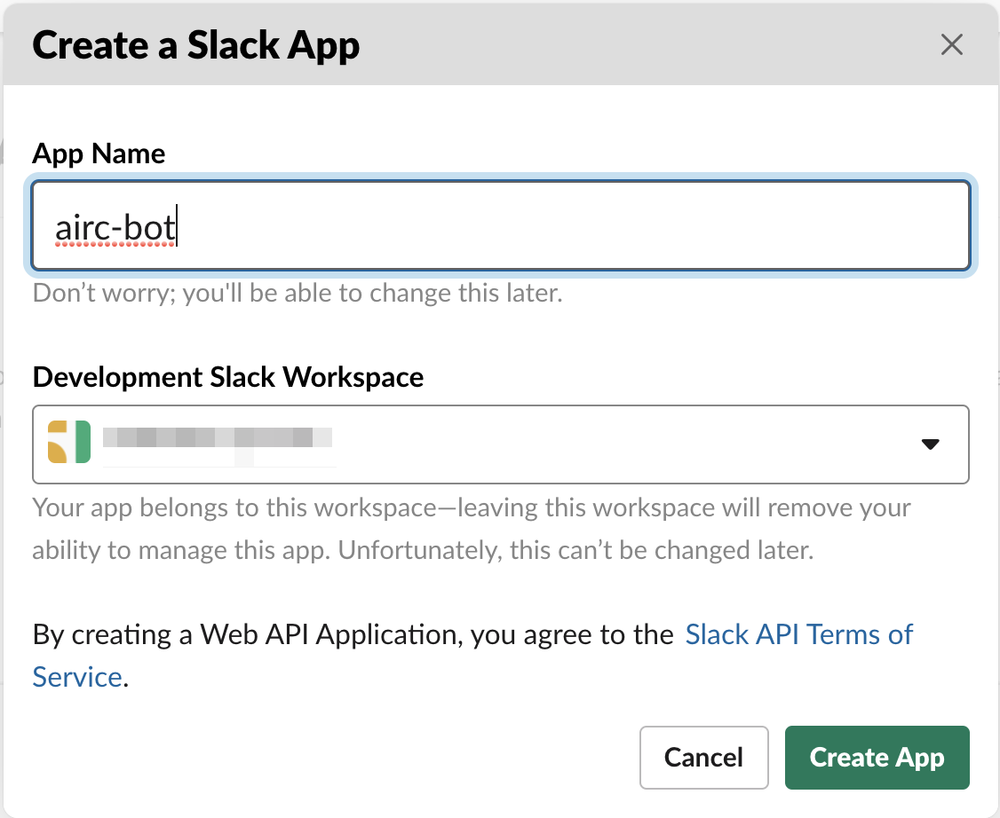

# private-smart-home-with-raspberry-pi

## 使用上の注意点

以下のライブラリのインポートは、Raspberry Pi 上でのみインポート可能。  
MacOS 上ではエラーとなるため、デバック時は注意。

```javascript
const i2c = require("i2c-bus");
```

## Architecture



## Demo


## 環境設定

```bash
yarn install
```

`.env`ファイルを用意する。

```
SLACK_SIGNING_SECRET=xxxxxxxxxxx
```

## ブログ記事の草案から抜粋

外部から DDNS 経由での Raspberry Pi のアクセスを試みるも、家庭のネットワーク環境によっては無理？  
以下の内容は、ここから転載。

https://github.com/Imamachi-n/gatsby-my-blog/blob/master/src/pages/2019/0801-private-smart-home-with-rasp/index.md

## 1. Raspberry Pi の各種設定

### Raspberry Pi をアップデートする

まず、Raspberry Pi のファームウェアをアップデートします。  
アップデートが完了したら、Raspberry Pi を再起動します。

```bash
$ sudo rpi-update
$ sudo reboot
```

次に、Raspberry Pi に保存されているパッケージをすべてアップグレード・アップデートします。

```bash
$ sudo apt upgrade
$ sudo apt update
```

ファイル編集用に、vim をインストールしておく。

```bash
$ sudo apt install -y vim
```

### root のパスワードを設定する

```bash
$ sudo passwd root
```

新しいパスワードを 2 回入力し、

```
passwd: パスワードは正しく更新されました
```

と表示されれば OK

### 新しいユーザを作成する

新しいユーザを作成。

```bash
$ sudo adduser imamachi
```

pi ユーザの権限を確認。

```bash
$ groups pi
pi : pi adm dialout cdrom sudo audio video plugdev games users input netdev spi i2c gpio
```

権限を設定。

```bash
$ sudo usermod -G pi,adm,dialout,cdrom,sudo,audio,video,plugdev,games,users,input,netdev,spi,i2c,gpio newuser
```

新規ユーザの権限を確認。

```bash
$ groups newuser
newuser : newuser adm dialout cdrom sudo audio video plugdev games users input netdev pi spi i2c gpio
```

pi ユーザのデータを新規ユーザにすべてコピー

```bash
sudo cp -r /home/pi/* /home/newuser
```

pi ユーザによるオートログインを無効化。

```bash
# `autologin-user=pi`をコメントアウト
$ sudo vim /etc/lightdm/lightdm.conf
autologin-user=pi
# autologin-user=pi
```

pi ユーザを無効化。ログインできないように設定変更する。

```bash
$ sudo passwd --lock pi
```

### SSH の設定

Raspberry Pi の設定画面から、SSH と I2C を有効化する。

```bash
$ sudo raspi-config
# 5 Interfacing Optionsを選択
# P2 SSH, P5 I2CをEnabledに変更。
```

SSH 接続させるために、ローカル PC（MacOS）で SSH キーを作成する。  
`~/.ssh/id_sra.pub`が生成されるので、これを Raspberry Pi 側の`authorized_keys`に登録する。

```bash
$ ssh-keygen -t rsa -b 4096 -C "your_email@example.com"
```

以下で、`/etc/ssh/sshd_config`の内容を変更する。

#### (1) 公開鍵認証の設定

以下の２つについて、コメントアウトしているのは解除し、PubKeyAuthentication を yes に書き換えます。

```
PubkeyAuthentication yes
# Expect .ssh/authorized_keys2 to be disregarded by default in future.
AuthorizedKeysFile .ssh/authorized_keys .ssh/authorized_keys2
```

#### (2) BASIC 認証をできないようにする

コメントアウトしているのは解除し、PasswordAuthentication を no に書き換えます。

```
# To disable tunneled clear text passwords, change to no here!
PasswordAuthentication no
```

#### (3) Root ログインをできないようにする

コメントアウトしているのは解除し、PermitRootLogin を no に書き換えます。

```
PermitRootLogin no
```

### (4) 公開鍵のみでのログインを許可しない

Pluggable Authentication Modules（PAM）または Linux のネイティブな認証を無効化して、キーを使ったログインのみを許可しないようにする。

```
UsePAM no
```

### (5) 認証時の時間や試行回数を制限する

コネクションを貼って認証するまでの猶予時間`LoginGraceTime`と、試行回数`MaxAuthTries`を設定しておきます。  
デフォルトでコメントアウトされているので解除します。

```
LoginGraceTime 2m
MaxAuthTries 6
```

### (6) SSH 接続可能なユーザを限定する

```
AllowUsers newuser
```

### (7) SSH 接続時のポート番号を変更する

10000 ～ 64000 の間の適当な数をポートに割り当てる。

```
Port 61000
```

ここまで終わったら、SSH のサービスを再起動。

```bash
$ sudo service ssh restart
```

### ファイアウォールの設定

```bash
$ sudo apt install ufw
```

ファイアウォールのステータスを確認

```bash
$ sudo ufw status
Status: inactive
```

下のコマンドで、ファイヤーウォールを有効にします。
有効にする前にファイヤーウォールのルールを追加します。
SSH で接続して設定している場合は、ブロックされるかもしれないため、本当に有効にしてよいかを聞いてきます。
SSH を使い続ける場合は、SSH の接続を可能にしてから、有効にしましょう。

```bash
$ sudo ufw enable
Command may disrupt existing ssh connections. Proceed with operation (y|n)? y
Firewall is active and enabled on system startup
```

#### (1) 使用しないポートを塞ぐ

基本的に、すべてブロックする設定にします。SSH 接続（22 ポート）については、IP アドレス指定で
自分の PC に振られているローカル IP アドレスのみを許可します（ルータの設定で、自分の PC のに振られる IP アドレスを予約してます）。

```bash
$ sudo ufw default deny
$ sudo ufw allow proto tcp from 192.168.10.43 to any port 61000
$ sudo ufw allow 80
$ sudo ufw allow 443
```

```bash
$ sudo ufw status
Status: active

To                         Action      From
--                         ------      ----
61000/tcp                  ALLOW       192.168.10.43
80                         ALLOW       Anywhere
80 (v6)                    ALLOW       Anywhere (v6)
```

#### (2) 連続してアクセスしてくる IP アドレスの接続を許可しない

これにより「30 秒間の間に 6 回以上接続を試みた IP アドレスを許可しない」ルールが設定されます。

```bash
$ sudo ufw limit 22
```

### 参考資料

[そこそこセキュアな linux サーバーを作る](https://qiita.com/cocuh/items/e7c305ccffb6841d109c#5-%E4%BD%BF%E3%82%8F%E3%81%AA%E3%81%84%E3%83%9D%E3%83%BC%E3%83%88%E3%82%92%E9%96%89%E3%81%98%E3%82%8B)

[Raspberry Pi を攻撃から守るための手順](https://makezine.jp/blog/2017/09/secure-your-raspberry-pi-against-attackers.html)

[iptables が難しいため ufw で WEB サーバーのファイアウォール設定](https://qiita.com/shimakaze_soft/items/c3cce2bfb7d584e1fbce)

[ufw コマンドの使い方](https://qiita.com/hana_shin/items/a630871dce209cff04f3#7-%E3%82%A2%E3%83%97%E3%83%AA%E3%82%B1%E3%83%BC%E3%82%B7%E3%83%A7%E3%83%B3%E3%82%A4%E3%83%B3%E3%83%86%E3%82%B0%E3%83%AC%E3%83%BC%E3%82%B7%E3%83%A7%E3%83%B3application-integration%E3%81%AE%E4%BD%BF%E3%81%84%E6%96%B9)

## Node.js, npm, yarn をインストール

```bash
sudo apt install nodejs npm yarn
```

## DDNS の設定

```bash
sudo apt install ddclient
```

`/etc/ddclient.conf`

```
ssl=yes
protocol=googledomains
use=web
login=xxxxxxxxxxxx
password=xxxxxxxxxxxxx
xxxxx.com
```

```bash
$ sudo service ddclient restart
$ sudo ddclient -query
```

```bash
sudo ddclient -daemon=0 -verbose
```

## Slack アプリを作成する

以下の URL から、自分のアプリを作成します。  
<https://api.slack.com/apps>





### テスト用のサーバを用意する

ngrok  
<https://ngrok.com/>

<https://api.slack.com/tutorials/tunneling-with-ngrok>

ngrok をダウンロードして、解凍します。

```bash
unzip /path/to/ngrok.zip
```

自分のアカウントにアクセスするために、トークンを登録します。
トークンは、ngrok の自分のアカウント画面から取得できます。

```bash
$ ngrok authtoken xxxxxxxxxxxxxx
```

`ngrok`に実行権限を与え、パスが通っているディレクトリに`ngrok`を移動させます。

```bash
$ cd /path/to/
$ chmod 755 ngrok
$ mv mgrok /usr/local/bin
```

パスが通っている場所は、`$PATH`の内容を見て調べます。

```bash
$ echo $PATH
```

`ngrok`のヘルプを見て、パスが通っているかどうか確認します。

```bash
$ ngrok help
```

public URL を生成して、自分の PC の localhost にフォワーディングします。

```
$ ngrok http 80
```

### Slack SDK と Express を使って REST API サーバを作る

Slack からのリクエストかどうか調べるため、リクエスト署名（Signing Secret）を使う。
Slack がアプリに送信するすべてのリクエストには、X-Slack-Signature HTTP ヘッダーが含まれています。
このヘッダーには、HMAC-SHA256 キー付きハッシュが設定されています。

Slack から取得したシークレットキーは、プロジェクトフォルダのルートに`.env` ファイルに保管する。

```
# .env
SLACK_SIGNING_SECRET=xxxxxxxxxxxxxx
```

```bash
$ yarn add @slack/web-api @slack/events-api
$ yarn add express axios body-parser crypto tsscmp dotenv
```

#### 参考資料

[リクエスト署名 - Slack アプリのセキュリティ強化](https://qiita.com/jimray/items/01ede94880d7278fb478#%E3%83%AA%E3%82%AF%E3%82%A8%E3%82%B9%E3%83%88%E7%BD%B2%E5%90%8D)

[リクエスト情報の認証 - Slack メッセージ・アクション API を使ってディスカバラブルなアプリを作ろう](https://qiita.com/girlie_mac/items/21fedcc6ce07aa44a670#-%E3%83%AA%E3%82%AF%E3%82%A8%E3%82%B9%E3%83%88%E6%83%85%E5%A0%B1%E3%81%AE%E8%AA%8D%E8%A8%BC)

## Nginx の設定

```bash
$ sudo apt install nginx
```

```bash
$ sudo systemctl start nginx
```

```bash
$ sudo systemctl restart nginx
```

`/etc/nginx/sites-enabled/default`ファイル

```
location / {
  proxy_set_header Host $host;
  proxy_set_header X-Real-IP $remote_addr;
  proxy_set_header X-Forwarded-Host $host;
  proxy_set_header X-Forwarded-Server $host;
  proxy_set_header X-Forwarded-For $proxy_add_x_forwarded_for;
  proxy_pass http://localhost:5000;
        }
```

設定ファイルのテスト

```bash
$ sudo nginx -t
```

ファイアウォール設定。

```bash
$ sudo ufw app list

$ sudo ufw allow 'Nginx Full'
```

ログ確認
`/var/log/nginx`

## Let's encrypt で証明書発行

```bash
$ sudo apt install certbot python-certbot-nginx
```

```bash
$ sudo certbot --nginx
```

ログ`/var/log/letsencrypt/letsencrypt.log`

Let’s Encrypt - a free, automated, and open Certificate Authority  
<https://letsencrypt.org/>

Setup Let's Encrypt for Express  
<https://flaviocopes.com/express-letsencrypt-ssl/>

## TODO リスト

- Google WiFi で「80->80」へポートフォワーディング。
- Nginx(Port:80) -> Express(Port:5000)
- GET メソッドで`/`へアクセス可能にする。
  DDClinet の設定を行い、DDNS を有効化する。

- Nginx のリバースプロキシの設定（特に Slack 専用の Header 情報の受け渡し）
- forever による Express サーバの永続化

### 注意書き

- 80, 443 port は、ISP（インターネットプロバイダ）によって塞がれている事が多いので、別のポートを選択したほうがいい。
  この場合、ルータ側でポートフォワーディングしても無駄。
